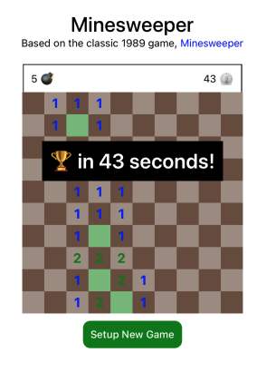
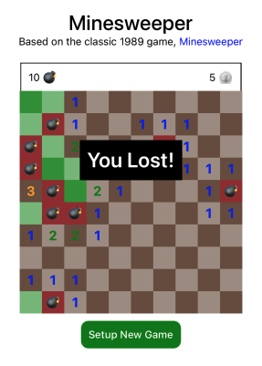
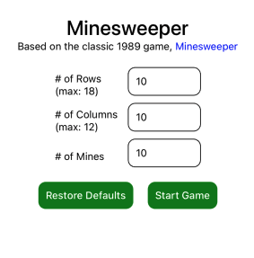

# Minesweeper
Minesweeper for mobile in the React Native framework




## Description

A mobile game app featuring the 1989 classic, Minesweeper.

## Preparing the App

- Initialize the project using ```npm i```
- iOS - run ```cd ios && pod install``` to get pods (cocoapods required - follow download instructions here [here](https://cocoapods.org/))

## Running the App

- iOS - run ```npx react-native start``` to start metro server. In new terminal window, on the project root, run ```npx react-native run-ios```
- Android - run ```npx react-native start``` to start metro server. In new terminal window, on the project root, run ```npx react-native run-android```

## Directions for Future Development

- AsyncStorage to bring up highscores
- onLongPress to flag possible mines
- Landscape orientation to allow for more columns